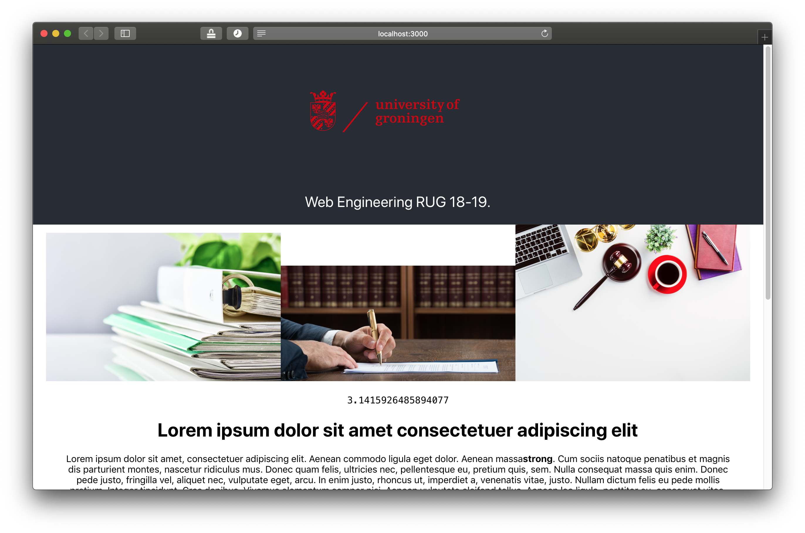

# ⚡️ Progressive Web Apps ⚡️
> Web Engineering 2018-2019

Small demonstration of making a webapp progressive along with the presentation. Shows a webpage which is slown down by inefficiently compressed images and non-asynchronous calculation of PI. Shows how both can be fixed in different branches.

[](https://docs.google.com/presentation/d/e/2PACX-1vQEmT-fp3axN0eC6zvGq10uWvuFsQCnDP4A0fCkYZC7G8tRfHIdLMXDTIWUmovMhwKzdbtlrlylwiNa/pub?start=false&loop=false&delayms=3000)

[Google Slides](https://docs.google.com/presentation/d/e/2PACX-1vQEmT-fp3axN0eC6zvGq10uWvuFsQCnDP4A0fCkYZC7G8tRfHIdLMXDTIWUmovMhwKzdbtlrlylwiNa/pub?start=false&loop=false&delayms=3000)

## Demo

## Run

App can be started by running:

```shell
yarn start
```

Should open a browser window at [`localhost:3000`](http://localhost:3000/) showing the following:

<a href="http://localhost:3000"></a>

✌🏻

## Structure

Open different branches to see different features implemented.

Branch `webp`: switches to using `.webp` images

Branch `pi`: shows how we can use a `WebWorker` in order to compute PI on a separate background thread instead - unblocking the rendering process.

## About

By Jeroen Overschie.


